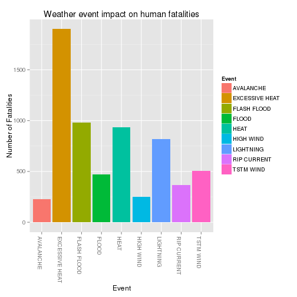
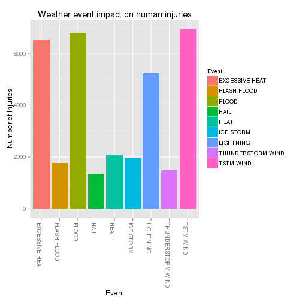
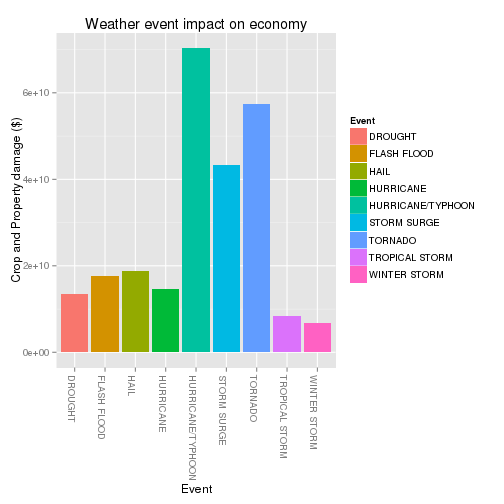

## Synopsis
In this report I present an analysis of the most adverse weather events in the United States between 1950-2011 using the [U.S. National Oceanic and Atmospheric Administration's (NOAA) storm database](https://d396qusza40orc.cloudfront.net/repdata%2Fdata%2FStormData.csv.bz2). Specifically, the data analysis shed lights on (1) the most harmful weather events with respect to population health, and (2) events with the greatest economic consequence. This analysis is conducted using R GNU and this report is written in R markdown language and compiled/generated using knitr.

## Data Processing

***

**Background documentation:**

* National Weather Service [Storm Data Documentation](https://d396qusza40orc.cloudfront.net/repdata%2Fpeer2_doc%2Fpd01016005curr.pdf)
* National Climatic Data Center Storm Events [FAQ](https://d396qusza40orc.cloudfront.net/repdata%2Fpeer2_doc%2FNCDC%20Storm%20Events-FAQ%20Page.pdf)

***

Load libraries 

```r
#load all required libraries
library(magrittr)   #knitr dependency
library(ggplot2)    #ggplot 
library(dplyr)      #data transformation
```

```
## 
## Attaching package: 'dplyr'
## 
## The following objects are masked from 'package:stats':
## 
##     filter, lag
## 
## The following objects are masked from 'package:base':
## 
##     intersect, setdiff, setequal, union
```

Read compressed data (provided the data is in the current directory).

```r
storm_data <- read.csv("repdata-data-StormData.csv.bz2")
```

The following code subsets the data such that we summarise and order each event according to either number of fatalities (variable: *storm\_data\_fat*) or injuries (*storm\_data\_inj*). This transformation is a prerequisite for answering question 1. 

```r
#subset and summaries each event according to number of fatalities
storm_data_fat <- storm_data %>% select(EVTYPE, FATALITIES) %>% group_by(EVTYPE) %>% summarise_each(funs(sum))

#order the data in decreasing order
storm_data_fat <- storm_data_fat[order(storm_data_fat$FATALITIES, decreasing = TRUE),]

#rename column names
colnames(storm_data_fat) <- c("Event", "Fatalities")

#subset and summaries each event according to number of injuries
storm_data_inj <- storm_data %>% select(EVTYPE, INJURIES) %>% group_by(EVTYPE) %>% summarise_each(funs(sum))

#order the data in decreasing order
storm_data_inj <- storm_data_inj[order(storm_data_inj$INJURIES, decreasing = TRUE),]

#rename column names
colnames(storm_data_inj) <- c("Event", "Injuries")
```


The following code subsets the data in order to summarise and order each event by property damage in US dollar. This transformation is a prerequisite for answering question 2. 

```r
#subset original data to only reflect events and property damage. 
storm_data_propdmg <- storm_data %>% select(EVTYPE, PROPDMG, PROPDMGEXP) %>% group_by(EVTYPE, PROPDMGEXP) %>% summarise_each(funs(sum))

#property damage (PROPDMG) is recorded using 3 significant digits; and the magnitude is indicated by the PROPDMGEXP (“K” for thousands, “M” for millions, and “B” for billions). Thus, the data is tranformed to reflect the full amount within the PROPDMG variable.
storm_data_propdmg[storm_data_propdmg$PROPDMGEXP=="K",]$PROPDMG <- storm_data_propdmg[storm_data_propdmg$PROPDMGEXP=="K",]$PROPDMG*1000
storm_data_propdmg[storm_data_propdmg$PROPDMGEXP=="M",]$PROPDMG <- storm_data_propdmg[storm_data_propdmg$PROPDMGEXP=="M",]$PROPDMG*1000000
storm_data_propdmg[storm_data_propdmg$PROPDMGEXP=="B",]$PROPDMG <- storm_data_propdmg[storm_data_propdmg$PROPDMGEXP=="B",]$PROPDMG*1000000000

#summaries property damage by event
storm_data_propdmg <- storm_data_propdmg %>% select(EVTYPE, PROPDMG) %>% group_by(EVTYPE) %>% summarise_each(funs(sum))

#order the data in decreasing order
storm_data_propdmg  <-storm_data_propdmg[order(storm_data_propdmg$PROPDMG, decreasing = TRUE),]

#change the column names to more descriptive names
colnames(storm_data_propdmg)[1] <- "Event"
colnames(storm_data_propdmg)[2] <- "Damage($)"
```

The following code subsets the data in order to summarise and order each event by crop damage in US dollar. This transformation is a prerequisite for answering question 2. 

```r
#subset original data to only reflect events and crop damage. 
storm_data_cropdmg <- storm_data %>% select(EVTYPE, CROPDMG, CROPDMGEXP) %>% group_by(EVTYPE, CROPDMGEXP) %>% summarise_each(funs(sum))

#crop damage (CROPDMG) is recorded using 3 significant digits; and the magnitude is indicated by the PROPDMGEXP (“K” for thousands, “M” for millions, and “B” for billions). Thus, the data is tranformed to reflect the full amount within the PROPDMG variable.
storm_data_cropdmg[storm_data_cropdmg$CROPDMGEXP=="K",]$CROPDMG <- storm_data_cropdmg[storm_data_cropdmg$CROPDMGEXP=="K",]$CROPDMG*1000
storm_data_cropdmg[storm_data_cropdmg$CROPDMGEXP=="M",]$CROPDMG <- storm_data_cropdmg[storm_data_cropdmg$CROPDMGEXP=="M",]$CROPDMG*1000000
storm_data_cropdmg[storm_data_propdmg$CROPDMGEXP=="B",]$CROPDMG <- storm_data_cropdmg[storm_data_propdmg$CROPDMGEXP=="B",]$CROPDMG*1000000000

#summaries crop damage by event
storm_data_cropdmg <- storm_data_cropdmg %>% select(EVTYPE, CROPDMG) %>% group_by(EVTYPE) %>% summarise_each(funs(sum))

#order the data in decreasing order
storm_data_cropdmg  <-storm_data_cropdmg[order(storm_data_cropdmg$CROPDMG, decreasing = TRUE),]

#change the column names to more descriptive names
colnames(storm_data_cropdmg)[1] <- "Event"
colnames(storm_data_cropdmg)[2] <- "Damage($)"
```

Lets transform the data, combine crop and property damage, to enable us to extract the combined cost. This transformation is again a prerequisite for answering question 2.

```r
#combine crop and property damage subsets
storm_data_combdmg <- rbind(storm_data_cropdmg, storm_data_propdmg) %>% group_by(Event) %>% summarise_each(funs(sum))

#order the data in decreasing order
storm_data_combdmg  <-storm_data_combdmg[order(storm_data_combdmg$`Damage($)`, decreasing = TRUE),]
```

## Results
Now that we have processed the data accordingly and we can use simple table print and plotting to answer some basic questions:

**1. Across the United States, which types of events are most harmful with respect to population health?**

Let have a look at the top 10 weather events that causes most human fatalities:

```r
print.data.frame(storm_data_fat[1:10,])
```

```
##             Event Fatalities
## 1         TORNADO       5633
## 2  EXCESSIVE HEAT       1903
## 3     FLASH FLOOD        978
## 4            HEAT        937
## 5       LIGHTNING        816
## 6       TSTM WIND        504
## 7           FLOOD        470
## 8     RIP CURRENT        368
## 9       HIGH WIND        248
## 10      AVALANCHE        224
```

Let have a look at the top 10 weather events that causes most human injuries:

```r
print.data.frame(storm_data_inj[1:10,])
```

```
##                Event Injuries
## 1            TORNADO    91346
## 2          TSTM WIND     6957
## 3              FLOOD     6789
## 4     EXCESSIVE HEAT     6525
## 5          LIGHTNING     5230
## 6               HEAT     2100
## 7          ICE STORM     1975
## 8        FLASH FLOOD     1777
## 9  THUNDERSTORM WIND     1488
## 10              HAIL     1361
```

We can clearly see that TORNADO tops the list for both injuries and fatalities by a huge margin. Thus, Torndo is the single event which is most harmful to with respect to population health.

Let have a look at the adverse top 10 weather events with regard to fatalities and injuries respectively (excluding the top ranked event: Tornado to avoid skewed plots).

```r
ggplot(storm_data_fat[2:10,], aes(x = Event, y = Fatalities, fill = Event)) + labs(x ="Event", y ="Number of Fatalities", title = "Weather event impact on human fatalities") + geom_bar(stat = "identity") + theme(axis.text.x=element_text(angle = -90, hjust = 0))
```

 


```r
ggplot(storm_data_inj[2:10,], aes(x = Event, y = Injuries, fill = Event)) + labs(x ="Event", y ="Number of Injuries", title = "Weather event impact on human injuries") + geom_bar(stat = "identity") + theme(axis.text.x=element_text(angle = -90, hjust = 0))
```

 


**2. Across the United States, which types of events have the greatest economic consequences?**

Let have a look at the top 10 weather events with the greatest adverse economic impact with regard to crop damage (US Dollars):

```r
print.data.frame(storm_data_cropdmg[1:10,])
```

```
##                Event   Damage($)
## 1            DROUGHT 12472566002
## 2              FLOOD  5661968450
## 3               HAIL  3025537890
## 4          HURRICANE  2741910000
## 5        FLASH FLOOD  1421317100
## 6       EXTREME COLD  1292973000
## 7  HURRICANE/TYPHOON  1097872802
## 8       FROST/FREEZE  1094086000
## 9         HEAVY RAIN   733399800
## 10    TROPICAL STORM   678346000
```

Let have a look at the 10 top weather events with the greatest adverse economic impact with regard to property damage (US Dollars):

```r
print.data.frame(storm_data_propdmg[1:10,])
```

```
##                Event    Damage($)
## 1              FLOOD 144657709807
## 2  HURRICANE/TYPHOON  69305840000
## 3            TORNADO  56925660790
## 4        STORM SURGE  43323536000
## 5        FLASH FLOOD  16140812067
## 6               HAIL  15727367053
## 7          HURRICANE  11868319010
## 8     TROPICAL STORM   7703890550
## 9       WINTER STORM   6688497251
## 10         HIGH WIND   5270046295
```

The following plot the combines (crop and property damage) tables (excluding the top event, FLOOD  (i.e., the event with the greatest consequence) to avoid a skewed plot) in order to answer which are are the top 10 events that have the greatest economic consequences?

```r
ggplot(storm_data_combdmg[2:10,], aes(x = Event, y = `Damage($)`, fill = Event)) + labs(x ="Event", y ="Crop and Property damage ($)", title = "Weather event impact on economy") + geom_bar(stat = "identity") + theme(axis.text.x=element_text(angle = -90, hjust = 0))
```

 

